

 

<a href="https://www.linkedin.com/in/mridul-katoch-160456364">LinkedIn</a> &nbsp;·&nbsp; <a href="mailto:mridulkatoch9028@gmail.com">Email</a>

 



 


<a href="https://github.com/mridul-chandra-katoch/robodoctor-ai-advanced"></a>
<a href="https://github.com/mridul-chandra-katoch/fake-accounts-detector-advanced-"></a>
<a href="https://github.com/mridul-chandra-katoch/Mental_Health"></a>

**Links:** [RoboDoctor AI repo](https://github.com/mridul-chandra-katoch/robodoctor-ai-advanced) · [live demo](https://robodoctor-ai-advanced.vercel.app/) · [Fake Account Detector repo](https://github.com/mridul-chandra-katoch/fake-accounts-detector-advanced-) · [Mental Health Companion repo](https://github.com/mridul-chandra-katoch/Mental_Health) 
RoboDoctor AI and Fake Account Detector are team projects; those repos are forks of a teammate's repo, and the cards state which part was mine. The dashed card is a goal, not a shipped project.

<!--
WHEN robodoctor-skin-lesion-cnn EXISTS (see ACTION_PLAN.md, step 1), point the RoboDoctor card's link at it:
https://github.com/mridul-chandra-katoch/robodoctor-skin-lesion-cnn
and keep the team repo + live demo in the Links line above.
WHEN the RAG repo exists, make card-next.svg a real card (copy card-robodoctor.svg's layout), drop the "PLANNED" tag, and link it.
-->

 


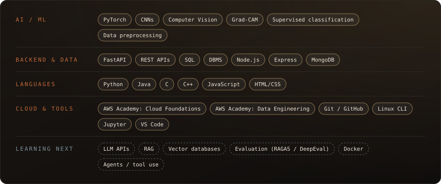

 



 


<a href="https://www.linkedin.com/in/mridul-katoch-160456364">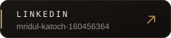</a>
&nbsp;
<a href="mailto:mridulkatoch9028@gmail.com">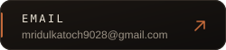</a>

<!--
OPTIONAL, ADD LATER: a GitHub activity/stats card.
Left out on purpose: with a young commit history it shows near-zero numbers, which undersells you.
Add one after a few months of real weekly commits. Use a self-hosted or well-known generator and
only keep it if the numbers are ones you are happy to be judged on.
-->

